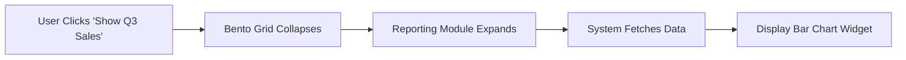
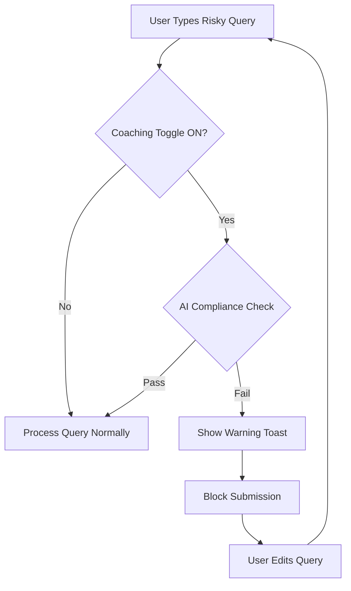
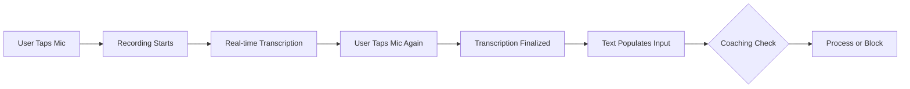
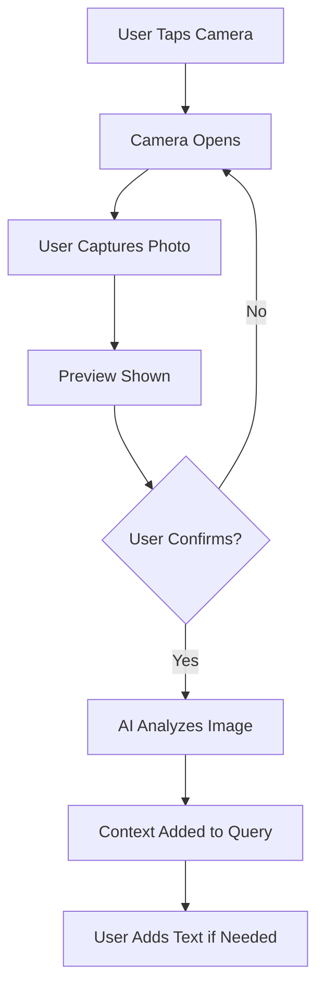

# Original Email
I think the key is being able to hide app interface and surface depending on the profile. Check the Digibot as an example at this link [https://www.dbs.com.sg/personal/support/home.html](https://www.dbs.com.sg/personal/support/home.html)

From: Khosla, Ajitesh <[ajitesh.khosla@astrazeneca.com](mailto:ajitesh.khosla@astrazeneca.com)>

Sent: Tuesday, January 13, 2026 2:27 PM

To: Bowman, Stephen (SPECIALIST STAFFING SOLUTIONS, INC.) <[stephen.bowman1@astrazeneca.com](mailto:stephen.bowman1@astrazeneca.com)>

Cc: Mendoza, Richard <[richard.mendoza@astrazeneca.com](mailto:richard.mendoza@astrazeneca.com)>; Prathipati, Chandrasekhar <[prathipati.chandrasekhar1@astrazeneca.com](mailto:prathipati.chandrasekhar1@astrazeneca.com)>; Yamashita, Arthur <[arthur.yamashita@astrazeneca.com](mailto:arthur.yamashita@astrazeneca.com)>

Subject: Rep Co-Pilot Wireframe

Hi Stephen,

I hope this email finds you well.

I apologize for the short notice, but we need your UI/UX expertise to create a few mockups for Rep Co-Pilot by tomorrow EOD. This tool will integrate with our existing applications like Reporting, CRM, and Compliance Assistants and bring it under one roof. The goal is to provide our Field Reps with a single access point for all the information they need, whether it's viewing dashboards, pre-call / post-call planning through the CRM, or need help with compliance questions.


I've attached some wireframes from McKinsey for Rep Co-Pilot and


[Lung OAS Dashboard - 121625 Wireframe.pdf](https://azcollaboration-my.sharepoint.com/personal/knhm807_astrazeneca_net/_layouts/15/guestaccess.aspx?share=IQBzskNDdkihQqEb9SEe5FsXASXiCccsSfs2fWw6qdSn9Lo)

Rep Copilot

Rep Copilot serves as the interface to the C2030 engagement engine

Initial design work is underway, beginning with ideation with Lung FLT

Rep Copilot ‘art-

of-the-possible’

Insights from Lung FLT offsite

A major theme is streamlining the daily decision flow through ‘day-in-the-

life’ views, including:

 ‘Good morning’ view (recommended engagements and call planning)

 ‘Execution’ view (pre-call planning via HCP insights and rationale to

engage, HCP interaction history, key messages to deliver)

 ‘Good evening’ view (end-of-day 'checkout' including prompts to log calls

and pull through on follow-up actions)

1 All materials contained in this presentation are preliminary and subject to final review

and approval by the AstraZeneca legal and compliance departmentsRep Copilot

Rep Copilot ‘art-

of-the-possible’

Empowering reps as the

“CEO of their GEO”

“Good morning” view

2 All materials contained in this presentation are preliminary and subject to final review

and approval by the AstraZeneca legal and compliance departmentsRep Copilot

Rep Copilot ‘art-

of-the-possible’

Empowering reps as the

“CEO of their GEO”

“Execution” view

3 All materials contained in this presentation are preliminary and subject to final review

and approval by the AstraZeneca legal and compliance departmentsRep Copilot

Rep Copilot ‘art-

of-the-possible’

Empowering reps as the

“CEO of their GEO”

“Good evening” view

4 All materials contained in this presentation are preliminary and subject to final review

and approval by the AstraZeneca legal and compliance departments

 for your reference. While the current wireframes show Rep Co-Pilot on top of a CRM, our vision is to have a full-screen view that allows for easy navigation through different screens. Here are some high-level requirements for the Rep Co-Pilot landing page:

  

Overall Layout and Features:

  

- The interface should present the three main elements (Reporting, CRM, Compliance Assistant) as distinct sections or tabs.
- Each element must display the top 5 clickable prompt buttons related to common commercial use cases for Field users. These prompts should provide quick, actionable answers.
- Beneath the prompts, include an input text field that allows users to type custom questions.
- Include multimedia input options adjacent to the text field: a camera button to upload photos to share their location and ask for best route to their next meeting, a microphone button to record spoken queries.
- Add a “magic wand” button to enhance or improve user-generated prompts for clarity and effectiveness.
- Include a “Coaching” option that helps users verify if their questions comply with AZ policies and guidelines, offering feedback or suggestions.

  

Prompt buttons

  

- Reporting

- Show me this quarter’s sales performance by region.
- Provide the top 5 prescribed products in my territory.
- What are the monthly trends in prescription volumes?
- Generate a report comparing last month’s and this month’s sales.
- Highlight areas with below-target sales.

  

- CRM

- Who are my top 10 accounts to prioritize this week?
- What is the recent activity history for Dr. John Doe?
- Schedule a follow-up meeting with Dr. John Doe”
- Show me open opportunities and their stages.
- Provide contact details and notes for healthcare providers in my region.

  

- Compliance Assistant

- What are the guidelines for off-label discussions?
- Meal Spend Limit for a lunch with HCP?
- What is the Speaker Chairperson Honorarium limit?
- Explain the proper procedure for adverse event reporting.

  

User Interaction Flow:

  

- Users can click any of the top 5 prompts under each element to receive instant answers or reports.
- Users can type a custom question in the input field or opt to submit queries via photo or voice input.
- After input, users can press the magic wand button to optimize their prompt for better AI understanding.
- Before submitting a query, users can toggle the Coaching option to validate compliance and receive recommendations.
- The UI should present responses clearly and related to the selected element for contextual relevance.

  

Design Considerations:

  

- Maintain a clean, intuitive layout aligning with existing AZ branding and style guidelines.
- Ensure accessibility for different input modes (typing, voice, photo).
- Use clear icons for camera, microphone, magic wand, and coaching features.
- Provide visual distinction between the three elements and their respective prompts.
- Design for ease of navigation with minimal clicks.

  

Please inform me if this impacts any of your current work so that we can adjust priorities. However, as this task is critical for our detailed workshop on Thursday, please consider it a high priority.

  

Thanks again for your collaboration and support.

  

Warm Regards,

Ajitesh Khosla
# Product Requirements Document: Rep Co-Pilot

---

| **Document Control** ||
|---|---|
| **Version** | 1.0 |
| **Status** | Approved for Design |
| **Date** | January 13, 2026 |
| **Author** | [Product Manager Name] |
| **Architecture Pattern** | Hybrid Bento Grid + Floating Command Dock |
| **Document Owner** | [Name] |
| **Last Updated** | January 13, 2026 |

---

## Version History

| Version | Date | Author | Change Description |
|---------|------|--------|-------------------|
| 0.1 | December 15, 2025 | [Author] | Initial draft |
| 0.5 | January 5, 2026 | [Author] | Stakeholder feedback incorporated |
| 1.0 | January 13, 2026 | [Author] | Approved for Design |

---

## Approval Matrix

| Role | Name | Signature | Date |
|------|------|-----------|------|
| Product Manager | | | |
| Engineering Lead | | | |
| Design Lead | | | |
| Compliance Officer | | | |
| Security Officer | | | |

---

## Table of Contents

1. [Executive Summary](#1-executive-summary)
2. [Problem Statement](#2-problem-statement)
3. [Product Vision & Goals](#3-product-vision--goals)
4. [User Personas](#4-user-personas)
5. [Jobs to Be Done (JTBD)](#5-jobs-to-be-done-jtbd)
6. [Scope & Boundaries](#6-scope--boundaries)
7. [Functional Requirements](#7-functional-requirements)
8. [Non-Functional Requirements](#8-non-functional-requirements)
9. [UI/UX Specifications](#9-uiux-specifications)
10. [Interaction Flows](#10-interaction-flows)
11. [Technical Architecture](#11-technical-architecture)
12. [Data Requirements](#12-data-requirements)
13. [API Specifications](#13-api-specifications)
14. [Security & Privacy](#14-security--privacy)
15. [Accessibility Requirements](#15-accessibility-requirements)
16. [Analytics & Tracking](#16-analytics--tracking)
17. [Error Handling](#17-error-handling)
18. [Edge Cases](#18-edge-cases)
19. [Dependencies](#19-dependencies)
20. [Assumptions & Constraints](#20-assumptions--constraints)
21. [Risk Assessment](#21-risk-assessment)
22. [Success Metrics & KPIs](#22-success-metrics--kpis)
23. [Release Strategy](#23-release-strategy)
24. [Testing Requirements](#24-testing-requirements)
25. [RACI Matrix](#25-raci-matrix)
26. [Glossary](#26-glossary)
27. [Appendix](#27-appendix)

---

## 1. Executive Summary

**Rep Co-Pilot** is a full-screen, unified "Command Center" for Field Representatives. Unlike previous sidebar-only iterations, this application serves as the primary landing page for the Rep's day. It consolidates three fragmented workflows—**Reporting**, **CRM**, and **Compliance**—into a single interface, utilizing Generative AI to streamline data retrieval, route planning, and policy adherence.

### Key Deliverables

| Deliverable | Description | Priority |
|-------------|-------------|----------|
| Bento Grid Interface | 3-module visual dashboard | P0 |
| Smart Input Dock | Multimodal AI input system | P0 |
| Compliance Guardrails | Real-time policy validation | P0 |
| Magic Wand Enhancer | Prompt optimization engine | P1 |

---

## 2. Problem Statement

### 2.1 Current State

Field Representatives currently navigate between **3 separate applications** to complete daily tasks:

| Pain Point | Impact | Frequency |
|------------|--------|-----------|
| Context switching between Reporting, CRM, and Compliance tools | 47 minutes lost daily | Daily |
| Manual policy lookup for compliance questions | 12 minutes per inquiry | 5x/day |
| Fragmented customer data across systems | Missed follow-ups (23% rate) | Weekly |
| No unified mobile-first experience | Reduced field productivity | Continuous |

### 2.2 Problem Statement (Structured)

> **For** Field Representatives  
> **Who** must manage territory performance, customer relationships, and compliance adherence  
> **The** Rep Co-Pilot  
> **Is a** unified AI-powered command center  
> **That** consolidates all three workflows into a single conversational interface  
> **Unlike** the current fragmented tool ecosystem  
> **Our product** reduces administrative friction by 60% and ensures 100% compliance visibility

---

## 3. Product Vision & Goals

### 3.1 Vision Statement

> To empower the Field Rep to act as the **"CEO of their GEO"** by reducing administrative friction. The interface is designed as a **"Conversational Hub"** where the Rep can instantly access high-frequency actions via a Bento Grid or execute complex tasks via a Smart Input Dock.

### 3.2 Strategic Goals (SMART Framework)

| Goal ID | Goal | Metric | Target | Timeline |
|---------|------|--------|--------|----------|
| G1 | Reduce time spent on administrative tasks | Time-on-task | 60% reduction | Q2 2026 |
| G2 | Improve compliance inquiry resolution | Resolution time | <30 seconds | Q2 2026 |
| G3 | Increase daily active usage | DAU/MAU ratio | >70% | Q3 2026 |
| G4 | Reduce compliance violations | Violation rate | 0% blocked queries submitted | Q2 2026 |
| G5 | Improve Rep satisfaction | NPS score | >50 | Q3 2026 |

### 3.3 Product Principles

| Principle | Description |
|-----------|-------------|
| **Speed First** | Every interaction should resolve in <3 seconds |
| **Zero Friction** | Maximum 2 taps to complete any high-frequency task |
| **Compliance by Default** | Guardrails are invisible until needed |
| **Conversational Intelligence** | Natural language as the primary interface paradigm |

---

## 4. User Personas

### 4.1 Primary Persona: Field Representative

| Attribute | Detail |
|-----------|--------|
| **Name** | Sarah Mitchell |
| **Role** | Field Sales Representative |
| **Experience** | 4 years in pharmaceutical sales |
| **Tech Proficiency** | Moderate (comfortable with mobile apps, CRM) |
| **Daily Tools** | iPhone 15 Pro, Company iPad, Laptop |
| **Work Context** | 80% time in field, 20% home office |
| **Key Frustrations** | "I spend more time on admin than selling" |
| **Goals** | Hit quarterly targets, maintain compliant interactions |
| **Behaviors** | Checks data between meetings, updates CRM in car, references compliance before HCP lunches |

### 4.2 Secondary Persona: District Manager

| Attribute | Detail |
|-----------|--------|
| **Name** | David Chen |
| **Role** | District Sales Manager |
| **Primary Need** | Team performance visibility |
| **Interaction Mode** | Read-only dashboards, aggregate views |

---

## 5. Jobs to Be Done (JTBD)

| Job ID | When... | I want to... | So that... | Priority |
|--------|---------|--------------|------------|----------|
| JTBD-01 | I'm preparing for my day | See my top priority accounts | I focus on highest-impact visits | P0 |
| JTBD-02 | I'm between meetings | Check my territory performance | I know where I stand vs. targets | P0 |
| JTBD-03 | I'm about to discuss a product | Verify compliance boundaries | I avoid policy violations | P0 |
| JTBD-04 | I'm planning an HCP lunch | Know the spending limits | I stay within policy | P0 |
| JTBD-05 | I receive a question I can't answer | Find accurate information fast | I maintain credibility | P1 |
| JTBD-06 | I'm driving to next appointment | Update my CRM hands-free | I capture information safely | P1 |
| JTBD-07 | I encounter an adverse event | Know proper reporting procedure | I fulfill regulatory obligations | P0 |

---

## 6. Scope & Boundaries

### 6.1 In Scope (v1.0)

| Feature | Description |
|---------|-------------|
| ✅ Reporting Module | Q3 sales, territory performance, trends |
| ✅ CRM Module | Account prioritization, activity history, scheduling |
| ✅ Compliance Module | Policy lookup, spending limits, procedure guidance |
| ✅ Smart Input Dock | Text, voice, and camera input |
| ✅ Magic Wand | Prompt enhancement |
| ✅ Coaching Toggle | Compliance guardrails |
| ✅ iOS Native App | Primary platform |

### 6.2 Out of Scope (v1.0)

| Feature | Rationale | Future Version |
|---------|-----------|----------------|
| ❌ Android Support | iOS represents 92% of field force | v1.5 |
| ❌ Offline Mode | Requires significant architecture changes | v2.0 |
| ❌ Manager Dashboard | Different persona, different product | v1.5 |
| ❌ Third-party Integrations | Focus on core workflows first | v2.0 |
| ❌ Multi-language Support | English-only markets for pilot | v1.5 |

### 6.3 Boundary Diagram

```
┌─────────────────────────────────────────────────────────────┐
│                      Rep Co-Pilot v1.0                       │
│  ┌──────────────────────────────────────────────────────┐   │
│  │                    In Scope                           │   │
│  │  • Reporting Module    • CRM Module                  │   │
│  │  • Compliance Module   • Smart Input Dock            │   │
│  │  • Magic Wand          • Coaching Toggle             │   │
│  │  • iOS Native App                                    │   │
│  └──────────────────────────────────────────────────────┘   │
└─────────────────────────────────────────────────────────────┘
          │                    │                    │
          ▼                    ▼                    ▼
   ┌─────────────┐     ┌─────────────┐     ┌─────────────┐
   │ Reporting   │     │  CRM        │     │ Compliance  │
   │ Data Lake   │     │  System     │     │ Policy DB   │
   └─────────────┘     └─────────────┘     └─────────────┘
        (API)               (API)              (API)
```

---

## 7. Functional Requirements

### 7.1 Feature Map

```
Rep Co-Pilot
├── F1: Landing Page (Bento Grid)
│   ├── F1.1: Reporting Module
│   ├── F1.2: CRM Module
│   └── F1.3: Compliance Module
├── F2: Smart Input Dock
│   ├── F2.1: Text Input
│   ├── F2.2: Voice Input (Microphone)
│   ├── F2.3: Vision Input (Camera)
│   └── F2.4: AI Tools
│       ├── F2.4.1: Magic Wand (Prompt Enhancer)
│       └── F2.4.2: Coaching Toggle (Compliance Guardrail)
└── F3: Response Display System
    ├── F3.1: Data Visualizations
    ├── F3.2: List Views
    └── F3.3: Text/Citation Views
```

---

### 7.2 Module A: Reporting

| Attribute | Specification |
|-----------|---------------|
| **Goal** | Instant access to territory performance and sales data |
| **Visual Output** | Data visualization (Bar/Line charts) and summary text |
| **Data Source** | Reporting Data Lake API |
| **Refresh Rate** | Real-time (T+0 for queries, nightly batch for underlying data) |

#### Preset Prompts (Chips)

| Chip ID | Prompt Text | Expected Output | Priority |
|---------|-------------|-----------------|----------|
| RP-01 | "Show me this quarter's sales performance by region." | Bar chart with regional breakdown + summary stats | P0 |
| RP-02 | "Provide the top 5 prescribed products in my territory." | Ranked list with Rx counts | P0 |
| RP-03 | "What are the monthly trends in prescription volumes?" | Line chart (12-month view) | P0 |
| RP-04 | "Generate a report comparing last month's and this month's sales." | Side-by-side comparison table | P1 |
| RP-05 | "Highlight areas with below-target sales." | Heat map or flagged list | P1 |

#### User Stories

| Story ID | User Story | Acceptance Criteria | Priority |
|----------|------------|---------------------|----------|
| US-RP-01 | As a Field Rep, I want to see my quarterly sales by region so that I can identify where to focus my efforts | **Given** I am logged in and on the Reporting module<br>**When** I tap "Show me this quarter's sales performance by region"<br>**Then** a bar chart displays within 3 seconds showing all regions with sales values<br>**And** a summary text appears below with top/bottom performers | P0 |
| US-RP-02 | As a Field Rep, I want to see top prescribed products so that I understand market dynamics | **Given** I tap RP-02 chip<br>**When** data loads<br>**Then** I see a ranked list of 5 products with Rx counts and % change from prior period | P0 |
| US-RP-03 | As a Field Rep, I want to see prescription volume trends so that I can identify patterns | **Given** I tap RP-03 chip<br>**When** data loads<br>**Then** I see a line chart with 12-month view, with ability to change time range | P0 |
| US-RP-04 | As a Field Rep, I want to compare sales periods so that I can track my progress | **Given** I tap RP-04 chip<br>**When** data loads<br>**Then** I see a comparison table with delta values and % change highlighted | P1 |
| US-RP-05 | As a Field Rep, I want to see underperforming areas so that I can take corrective action | **Given** I tap RP-05 chip<br>**When** data loads<br>**Then** I see a list of areas below target with gap-to-goal metrics | P1 |

---

### 7.3 Module B: CRM

| Attribute | Specification |
|-----------|---------------|
| **Goal** | Account management and scheduling execution |
| **Visual Output** | List views, Contact Cards, and Calendar slots |
| **Data Source** | CRM System API |
| **Write Capability** | Yes (scheduling, notes) |

#### Preset Prompts (Chips)

| Chip ID | Prompt Text | Expected Output | Priority |
|---------|-------------|-----------------|----------|
| CRM-01 | "Who are my top 10 accounts to prioritize this week?" | Ranked account list with priority scores | P0 |
| CRM-02 | "What is the recent activity history for Dr. [Name]?" | Activity timeline (visits, calls, emails) | P0 |
| CRM-03 | "Schedule a follow-up meeting with Dr. [Name]." | Calendar integration modal | P0 |
| CRM-04 | "Show me open opportunities and their stages." | Pipeline view with stages | P1 |
| CRM-05 | "Provide contact details and notes for healthcare providers in my region." | Contact cards with notes | P1 |

#### User Stories

| Story ID | User Story | Acceptance Criteria | Priority |
|----------|------------|---------------------|----------|
| US-CRM-01 | As a Field Rep, I want to see my priority accounts so that I can plan my week effectively | **Given** I tap CRM-01 chip<br>**When** data loads<br>**Then** I see 10 accounts ranked by priority score<br>**And** each card shows account name, priority score, last contact date, and next suggested action | P0 |
| US-CRM-02 | As a Field Rep, I want to see activity history for a specific doctor so that I can prepare for meetings | **Given** I tap CRM-02 chip<br>**When** I specify doctor name (or system infers from context)<br>**Then** I see chronological activity timeline with interaction types and notes | P0 |
| US-CRM-03 | As a Field Rep, I want to schedule meetings via natural language so that I save time on data entry | **Given** I tap CRM-03 chip<br>**When** I specify doctor name and preferred time<br>**Then** system shows available slots from both my calendar and HCP's known preferences<br>**And** I can confirm booking in 1 tap | P0 |
| US-CRM-04 | As a Field Rep, I want to see my open opportunities so that I can manage my pipeline | **Given** I tap CRM-04 chip<br>**When** data loads<br>**Then** I see opportunities grouped by stage with values and expected close dates | P1 |
| US-CRM-05 | As a Field Rep, I want to access HCP contact details and notes so that I have context before calls | **Given** I tap CRM-05 chip<br>**When** data loads<br>**Then** I see contact cards with key info, specialization, and recent notes | P1 |

---

### 7.4 Module C: Compliance Assistant

| Attribute | Specification |
|-----------|---------------|
| **Goal** | Policy verification and guardrails |
| **Visual Output** | Text citations, Policy Snippets, and Document links |
| **Data Source** | Compliance Policy Database |
| **Audit Requirement** | All queries logged with timestamp and response |

#### Preset Prompts (Chips)

| Chip ID | Prompt Text | Expected Output | Priority |
|---------|-------------|-----------------|----------|
| CA-01 | "What are the guidelines for off-label discussions?" | Policy text with citations | P0 |
| CA-02 | "Meal Spend Limit for a lunch with HCP?" | Specific limit value with context | P0 |
| CA-03 | "What is the Speaker Chairperson Honorarium limit?" | Specific limit value with policy reference | P0 |
| CA-04 | "Explain the proper procedure for adverse event reporting." | Step-by-step procedure with timeline | P0 |
| CA-05 | "View latest Compliance Policy PDF." | PDF viewer with search capability | P1 |

#### User Stories

| Story ID | User Story | Acceptance Criteria | Priority |
|----------|------------|---------------------|----------|
| US-CA-01 | As a Field Rep, I want to know off-label discussion guidelines so that I remain compliant | **Given** I tap CA-01 chip<br>**When** response displays<br>**Then** I see clear guidance with policy section citations<br>**And** a link to full policy document | P0 |
| US-CA-02 | As a Field Rep, I want to know meal spend limits so that I can plan HCP interactions | **Given** I tap CA-02 chip<br>**When** response displays<br>**Then** I see specific dollar limit, applicable conditions, and any regional variations | P0 |
| US-CA-03 | As a Field Rep, I want to know honorarium limits so that I ensure compliant speaker arrangements | **Given** I tap CA-03 chip<br>**When** response displays<br>**Then** I see limit value with tier information if applicable | P0 |
| US-CA-04 | As a Field Rep, I want to know AE reporting procedures so that I fulfill regulatory requirements | **Given** I tap CA-04 chip<br>**When** response displays<br>**Then** I see numbered steps, timeline requirements, and contact information for reporting | P0 |
| US-CA-05 | As a Field Rep, I want to access the full policy PDF so that I can reference specific sections | **Given** I tap CA-05 chip<br>**When** PDF loads<br>**Then** I can search within document and bookmark sections | P1 |

---

### 7.5 Smart Input Dock

| Attribute | Specification |
|-----------|---------------|
| **Position** | Persistent, floating, fixed to bottom center of viewport |
| **Visibility** | Always visible (z-index: 100) |
| **Behavior** | Expands on focus, contracts on blur |

#### F2.1: Text Input

| Requirement ID | Requirement | Acceptance Criteria |
|----------------|-------------|---------------------|
| SI-TEXT-01 | Free-text natural language queries | System parses and routes to appropriate module |
| SI-TEXT-02 | Character limit: 500 | Counter shown at 400+ characters |
| SI-TEXT-03 | Auto-complete suggestions | Top 3 suggestions appear after 3+ characters |
| SI-TEXT-04 | Query history | Last 10 queries accessible via up-arrow |

#### F2.2: Voice Input (Microphone)

| Requirement ID | Requirement | Acceptance Criteria |
|----------------|-------------|---------------------|
| SI-VOICE-01 | Voice-to-Text transcription | Real-time transcription displayed in input field |
| SI-VOICE-02 | Hands-free activation option | "Hey Co-Pilot" wake word (configurable) |
| SI-VOICE-03 | Noise cancellation | Functional in car environment (up to 70dB ambient) |
| SI-VOICE-04 | Language support | English (US) for v1.0 |
| SI-VOICE-05 | Punctuation handling | Automatic punctuation insertion |

#### F2.3: Vision Input (Camera)

| Requirement ID | Requirement | Acceptance Criteria |
|----------------|-------------|---------------------|
| SI-VISION-01 | Photo upload capability | Supports JPEG, PNG up to 10MB |
| SI-VISION-02 | Context extraction | AI interprets image for routing/context queries |
| SI-VISION-03 | Use case: Location photo | "What's the best route to this location?" |
| SI-VISION-04 | Use case: Document scan | Extract text from business cards, forms |
| SI-VISION-05 | Preview before send | Thumbnail with "X" to remove |

---

### 7.6 AI Tools

#### F2.4.1: Magic Wand (Prompt Enhancer)

| Attribute | Specification |
|-----------|---------------|
| **Trigger** | ✨ icon tap in input dock |
| **Logic** | Takes short, vague user input and expands into structured, context-rich prompt |
| **Example** | Input: "sales data" → Output: "Show me sales data for my top 3 territories for Q3, formatted as a table" |
| **UX** | Transforms text in-place within the input field |
| **Undo** | Single-tap to revert to original input |

| Requirement ID | Requirement | Acceptance Criteria |
|----------------|-------------|---------------------|
| MW-01 | Enhancement within 1 second | User sees transformation complete in <1s |
| MW-02 | Context-aware suggestions | Uses user's territory, role, and recent activity |
| MW-03 | Preview mode | Shows enhanced prompt before confirming |
| MW-04 | Revert capability | One-tap to restore original text |
| MW-05 | Learn from usage | Improves suggestions based on user confirmations |

#### F2.4.2: Coaching Toggle (Compliance Guardrail)

| Attribute | Specification |
|-----------|---------------|
| **Trigger** | 🛡️ toggle switch in input dock |
| **Default State** | ON |
| **Logic** | Binary switch. When ON, all queries intercepted by secondary LLM trained on AZ Policy |
| **Behavior** | Non-compliant queries blocked with Toast/Bubble alert explaining violation |
| **Override** | Not permitted in v1.0 |

| Requirement ID | Requirement | Acceptance Criteria |
|----------------|-------------|---------------------|
| CT-01 | Real-time query screening | Screening completes in <500ms |
| CT-02 | Clear violation explanation | Toast message explains specific violation |
| CT-03 | Suggested correction | System suggests compliant alternative phrasing |
| CT-04 | Audit logging | All blocked queries logged with timestamp, user ID, violation type |
| CT-05 | Toggle state persistence | User's preference persists across sessions |
| CT-06 | Manager visibility | Managers can view aggregate compliance metrics (anonymized) |

**Compliance Check Flow State Machine:**

```
┌─────────────┐     Query      ┌─────────────┐
│    IDLE     │ ─────────────► │  CHECKING   │
└─────────────┘                └─────────────┘
                                     │
                         ┌───────────┼───────────┐
                         ▼           ▼           ▼
                   ┌─────────┐ ┌─────────┐ ┌─────────┐
                   │  PASS   │ │  WARN   │ │  BLOCK  │
                   └─────────┘ └─────────┘ └─────────┘
                        │           │           │
                        ▼           ▼           │
                   ┌─────────┐ ┌─────────┐      │
                   │ PROCESS │ │ CONFIRM │      │
                   └─────────┘ └─────────┘      │
                                    │           │
                                    ▼           ▼
                              ┌─────────────────────┐
                              │        IDLE         │
                              └─────────────────────┘
```

---

## 8. Non-Functional Requirements

### 8.1 Performance Requirements

| NFR ID | Category | Requirement | Target | Measurement |
|--------|----------|-------------|--------|-------------|
| NFR-P01 | Response Time | Initial app load | <2 seconds | 95th percentile |
| NFR-P02 | Response Time | Chip prompt response | <3 seconds | 95th percentile |
| NFR-P03 | Response Time | Free-text query response | <5 seconds | 95th percentile |
| NFR-P04 | Response Time | Magic Wand enhancement | <1 second | 95th percentile |
| NFR-P05 | Response Time | Compliance check | <500ms | 99th percentile |
| NFR-P06 | Throughput | Concurrent users | 5,000+ | Load test |
| NFR-P07 | Availability | Uptime | 99.9% | Monthly SLA |

### 8.2 Scalability Requirements

| NFR ID | Requirement | Specification |
|--------|-------------|---------------|
| NFR-S01 | Horizontal scaling | Auto-scale based on demand |
| NFR-S02 | Geographic distribution | Multi-region deployment |
| NFR-S03 | Peak load handling | 3x normal capacity |

### 8.3 Reliability Requirements

| NFR ID | Requirement | Specification |
|--------|-------------|---------------|
| NFR-R01 | Mean Time Between Failures (MTBF) | >720 hours |
| NFR-R02 | Mean Time To Recovery (MTTR) | <15 minutes |
| NFR-R03 | Data durability | 99.999999999% (11 9s) |
| NFR-R04 | Graceful degradation | Core features available during partial outages |

### 8.4 Usability Requirements

| NFR ID | Requirement | Specification |
|--------|-------------|---------------|
| NFR-U01 | Learnability | New users complete core task within 2 minutes without training |
| NFR-U02 | Efficiency | Experienced users complete core task in <30 seconds |
| NFR-U03 | One-hand operation | All primary actions reachable with thumb |
| NFR-U04 | Font sizes | Minimum 16px body text |

---

## 9. UI/UX Specifications

### 9.1 Layout Strategy: The "Hybrid Bento"

| Attribute | Specification |
|-----------|---------------|
| **Structure** | 3-Column Grid Layout (responsive to 1-column on mobile portrait) |
| **Container Style** | Large "Bento" cards with `#F5F5F7` (Light Gray) background |
| **Border Radius** | 24px rounded corners |
| **Hierarchy** | Flat. No hidden tabs. All 15 prompts visible at a glance |
| **Spacing** | 16px gap between cards, 24px padding within cards |
| **Max Width** | 1440px container, centered |

#### Responsive Breakpoints

| Breakpoint | Layout | Columns |
|------------|--------|---------|
| Desktop (>1024px) | 3-column grid | 3 |
| Tablet (768px-1024px) | 2-column grid | 2 |
| Mobile (<768px) | Single column stack | 1 |

### 9.2 Component: The "Chip Cloud"

| Attribute | Specification |
|-----------|---------------|
| **Usage** | 5 prompts within each module |
| **Style** | Full-width pill-shaped buttons |
| **Typography** | Left-aligned text, 16px font size, medium weight |
| **Padding** | 16px vertical, 20px horizontal |
| **Background** | White (`#FFFFFF`) |
| **Border** | 1px solid `#E5E5EA` |
| **Border Radius** | 12px |

#### Interaction States

| State | Visual Treatment |
|-------|------------------|
| Default | White background, subtle border |
| Hover | 4px Y-axis lift, shadow increase |
| Pressed | Scale 0.98, darker background (`#F5F5F7`) |
| Active/Selected | Blue border (`#007AFF`), checkmark icon |
| Disabled | 50% opacity, no pointer |

### 9.3 Component: The "Floating Glass Dock"

| Attribute | Specification |
|-----------|---------------|
| **Position** | Sticky Bottom Center |
| **Z-Index** | 100 |
| **Style** | Glassmorphism effect |
| **Background** | White @ 80% opacity |
| **Backdrop Filter** | blur(40px) |
| **Drop Shadow** | 0px 10px 30px rgba(0, 0, 0, 0.15) |
| **Border Radius** | 28px |
| **Height** | 56px (collapsed), 180px (expanded) |
| **Width** | calc(100% - 32px), max 600px |
| **Margin Bottom** | 16px (safe area aware) |

#### Dock Layout

```
┌───────────────────────────────────────────────────────┐
│  🎤  │  📷  │  [        Text Input         ]  │ ✨ 🛡️ │ ▶ │
└───────────────────────────────────────────────────────┘
```

| Element | Position | Size | Purpose |
|---------|----------|------|---------|
| Microphone | Left | 44px | Voice input |
| Camera | Left | 44px | Vision input |
| Text Field | Center | Flex | Natural language input |
| Magic Wand | Right | 44px | Prompt enhancer |
| Shield | Right | 44px | Compliance toggle |
| Send | Right | 44px | Submit query |

### 9.4 Design Tokens

```css
/* Colors */
--color-background-primary: #FFFFFF;
--color-background-secondary: #F5F5F7;
--color-text-primary: #1D1D1F;
--color-text-secondary: #86868B;
--color-accent-primary: #007AFF;
--color-accent-success: #34C759;
--color-accent-warning: #FF9500;
--color-accent-error: #FF3B30;

/* Typography */
--font-family: -apple-system, BlinkMacSystemFont, 'SF Pro Display', sans-serif;
--font-size-h1: 28px;
--font-size-h2: 22px;
--font-size-body: 17px;
--font-size-caption: 13px;
--font-weight-regular: 400;
--font-weight-medium: 500;
--font-weight-semibold: 600;

/* Spacing */
--spacing-xs: 4px;
--spacing-sm: 8px;
--spacing-md: 16px;
--spacing-lg: 24px;
--spacing-xl: 32px;

/* Borders */
--border-radius-sm: 8px;
--border-radius-md: 12px;
--border-radius-lg: 24px;
--border-radius-full: 9999px;

/* Shadows */
--shadow-sm: 0 1px 3px rgba(0,0,0,0.08);
--shadow-md: 0 4px 12px rgba(0,0,0,0.1);
--shadow-lg: 0 10px 30px rgba(0,0,0,0.15);

/* Animation */
--transition-fast: 150ms ease;
--transition-normal: 250ms ease;
--transition-slow: 350ms ease;
```

---

## 10. Interaction Flows

### 10.1 The "Happy Path" (Clicking a Prompt)



#### Detailed Flow

| Step | Actor | Action | System Response | Duration |
|------|-------|--------|-----------------|----------|
| 1 | User | Taps chip "Show Q3 Sales" | Chip shows pressed state | 0ms |
| 2 | System | Collapse Bento Grid | Animate other modules down | 200ms |
| 3 | System | Expand Reporting Module | Full-screen takeover | 150ms |
| 4 | System | Show loading skeleton | Skeleton UI appears | 50ms |
| 5 | System | Fetch data via API | — | 1-2s |
| 6 | System | Render bar chart | Chart animates in | 300ms |
| 7 | System | Display summary text | Text fades in below chart | 150ms |

### 10.2 The "Coaching" Path (Active Guardrails)



#### Detailed Flow

| Step | Actor | Action | System Response | Duration |
|------|-------|--------|-----------------|----------|
| 1 | User | Types potentially non-compliant query | Real-time text capture | 0ms |
| 2 | User | Taps Send button | Query captured | 0ms |
| 3 | System | Check Coaching toggle state | — | 10ms |
| 4 | System | If ON: Send to Compliance LLM | Show "Checking..." | 300-500ms |
| 5 | System | If FAIL: Block submission | Prevent API call | 0ms |
| 6 | System | Display Toast | Error explanation + suggestion | 0ms |
| 7 | User | Reviews feedback | — | — |
| 8 | User | Edits query | System clears error state | 0ms |
| 9 | User | Resubmits | Return to Step 2 | — |

### 10.3 The "Voice Input" Path



### 10.4 The "Vision Input" Path



---

## 11. Technical Architecture

### 11.1 High-Level Architecture Diagram

```
┌─────────────────────────────────────────────────────────────────┐
│                        PRESENTATION LAYER                        │
│  ┌───────────────────────────────────────────────────────────┐  │
│  │                    iOS Native App (SwiftUI)                │  │
│  │  • Bento Grid UI    • Smart Input Dock    • Charts        │  │
│  └───────────────────────────────────────────────────────────┘  │
└─────────────────────────────────────────────────────────────────┘
                              │ HTTPS
                              ▼
┌─────────────────────────────────────────────────────────────────┐
│                          API GATEWAY                             │
│  • Authentication    • Rate Limiting    • Request Routing       │
└─────────────────────────────────────────────────────────────────┘
                              │
          ┌───────────────────┼───────────────────┐
          ▼                   ▼                   ▼
┌─────────────────┐ ┌─────────────────┐ ┌─────────────────┐
│   AI SERVICES   │ │  CORE SERVICES  │ │   DATA LAYER    │
│ ─────────────── │ │ ─────────────── │ │ ─────────────── │
│ • NLU Engine    │ │ • Reporting API │ │ • Data Lake     │
│ • Prompt Engine │ │ • CRM API       │ │ • CRM Database  │
│ • Compliance LLM│ │ • Compliance API│ │ • Policy Store  │
│ • Vision AI     │ │ • User Service  │ │ • Audit Log     │
│ • Speech-to-Text│ │                 │ │                 │
└─────────────────┘ └─────────────────┘ └─────────────────┘
```

### 11.2 Technology Stack

| Layer | Technology | Justification |
|-------|------------|---------------|
| Mobile App | Swift/SwiftUI | iOS primary platform, native performance |
| API Gateway | AWS API Gateway | Managed, scalable, integrated auth |
| AI/ML | Azure OpenAI Service | Enterprise LLM with compliance certifications |
| Compliance LLM | Fine-tuned GPT-4 | Custom model on policy documents |
| Speech-to-Text | Apple Speech Framework | Native iOS integration |
| Vision AI | Azure Computer Vision | Document analysis capability |
| Backend Services | Node.js / TypeScript | Developer ecosystem alignment |
| Data Lake | Snowflake | Existing enterprise data platform |
| CRM | Veeva | Existing system of record |
| Caching | Redis | Sub-second response times |
| Search | Elasticsearch | Policy document search |

### 11.3 Component Diagram

```
┌─────────────────────────────────────────────────────────────┐
│                      iOS Application                         │
│  ┌─────────────┐ ┌─────────────┐ ┌─────────────────────────┐│
│  │ View Layer  │ │ View Models │ │     Service Layer       ││
│  │ ─────────── │ │ ─────────── │ │ ───────────────────────  ││
│  │ BentoGrid   │ │ ReportingVM │ │ APIClient               ││
│  │ ModuleCard  │ │ CRMVM       │ │ AuthService             ││
│  │ ChipCloud   │ │ ComplianceVM│ │ CacheService            ││
│  │ InputDock   │ │ InputDockVM │ │ SpeechService           ││
│  │ ChartViews  │ │             │ │ VisionService           ││
│  └─────────────┘ └─────────────┘ └─────────────────────────┘│
└─────────────────────────────────────────────────────────────┘
```

---

## 12. Data Requirements

### 12.1 Data Model Overview

```
┌─────────────────────────────────────────────────────────────┐
│                        DATA ENTITIES                         │
├─────────────────┬─────────────────┬─────────────────────────┤
│   REPORTING     │      CRM        │     COMPLIANCE          │
├─────────────────┼─────────────────┼─────────────────────────┤
│ Territory       │ Account         │ PolicyDocument          │
│ Region          │ Contact (HCP)   │ PolicySection           │
│ Product         │ Opportunity     │ SpendLimit              │
│ SalesMetric     │ Activity        │ ComplianceQuery         │
│ PrescriptionData│ Meeting         │ QueryAuditLog           │
└─────────────────┴─────────────────┴─────────────────────────┘
```

### 12.2 Key Data Entities

#### User

| Field | Type | Description |
|-------|------|-------------|
| user_id | UUID | Primary key |
| employee_id | String | Employee identifier |
| name | String | Full name |
| email | String | Corporate email |
| role | Enum | REP, MANAGER, ADMIN |
| territory_ids | Array[UUID] | Assigned territories |
| preferences | JSON | App settings |
| created_at | Timestamp | Account creation |
| last_login | Timestamp | Most recent access |

#### Query

| Field | Type | Description |
|-------|------|-------------|
| query_id | UUID | Primary key |
| user_id | UUID | Foreign key to User |
| query_text | String | Original query |
| enhanced_text | String | Magic Wand output (if used) |
| query_type | Enum | CHIP, FREETEXT, VOICE, VISION |
| module | Enum | REPORTING, CRM, COMPLIANCE |
| compliance_status | Enum | PASSED, WARNED, BLOCKED, SKIPPED |
| response_time_ms | Integer | API latency |
| created_at | Timestamp | Query timestamp |

### 12.3 Data Flow Diagram

```
┌──────────┐     Query      ┌──────────────┐     Check     ┌──────────────┐
│   User   │ ─────────────► │  Input Dock  │ ────────────► │ Compliance   │
└──────────┘                └──────────────┘               │    Layer     │
                                   │                       └──────────────┘
                                   │ Route                        │
                                   ▼                              │ Pass/Fail
                            ┌──────────────┐                      │
                            │  NLU Engine  │◄─────────────────────┘
                            └──────────────┘
                                   │ Intent + Entities
                                   ▼
              ┌────────────────────┼────────────────────┐
              ▼                    ▼                    ▼
       ┌─────────────┐     ┌─────────────┐     ┌─────────────┐
       │  Reporting  │     │    CRM      │     │ Compliance  │
       │    API      │     │    API      │     │    API      │
       └─────────────┘     └─────────────┘     └─────────────┘
              │                    │                    │
              ▼                    ▼                    ▼
       ┌─────────────┐     ┌─────────────┐     ┌─────────────┐
       │  Data Lake  │     │  Veeva CRM  │     │ Policy DB   │
       └─────────────┘     └─────────────┘     └─────────────┘
```

### 12.4 Data Retention

| Data Type | Retention Period | Justification |
|-----------|------------------|---------------|
| Query logs | 7 years | Regulatory compliance |
| Compliance audit logs | 10 years | Legal requirement |
| User preferences | Active + 90 days | Post-departure cleanup |
| Cache data | 24 hours | Performance optimization |
| Voice recordings | Not stored | Privacy by design |

---

## 13. API Specifications

### 13.1 API Overview

| API | Method | Endpoint | Purpose |
|-----|--------|----------|---------|
| Submit Query | POST | `/api/v1/query` | Process natural language query |
| Get Reporting Data | GET | `/api/v1/reporting/{metric}` | Retrieve specific metric |
| Get CRM Data | GET | `/api/v1/crm/{entity}` | Retrieve CRM entities |
| Get Compliance Info | GET | `/api/v1/compliance/policy` | Retrieve policy information |
| Check Compliance | POST | `/api/v1/compliance/check` | Validate query compliance |
| Enhance Prompt | POST | `/api/v1/ai/enhance` | Magic Wand enhancement |

### 13.2 Endpoint Specifications

#### POST /api/v1/query

**Request:**
```json
{
  "query_text": "Show me this quarter's sales performance by region",
  "query_type": "CHIP",
  "module": "REPORTING",
  "user_id": "uuid",
  "coaching_enabled": true,
  "attachments": []
}
```

**Response (Success):**
```json
{
  "status": "success",
  "query_id": "uuid",
  "response_type": "CHART",
  "data": {
    "chart_type": "BAR",
    "title": "Q3 Sales by Region",
    "labels": ["North", "South", "East", "West"],
    "values": [1250000, 980000, 1100000, 875000],
    "currency": "USD"
  },
  "summary": "North region leads with $1.25M in Q3 sales...",
  "processing_time_ms": 1847
}
```

**Response (Compliance Block):**
```json
{
  "status": "blocked",
  "query_id": "uuid",
  "reason": "COMPLIANCE_VIOLATION",
  "violation_type": "OFF_LABEL_REFERENCE",
  "message": "Your query references off-label usage. Please rephrase.",
  "suggestion": "Consider asking about approved indications only.",
  "policy_reference": "Section 4.2.1"
}
```

### 13.3 Error Codes

| Code | Status | Description | Client Action |
|------|--------|-------------|---------------|
| 200 | Success | Request processed | Display response |
| 400 | Bad Request | Invalid input | Show validation error |
| 401 | Unauthorized | Token expired | Redirect to login |
| 403 | Forbidden | Insufficient permissions | Show access denied |
| 422 | Compliance Block | Query blocked | Show compliance toast |
| 429 | Rate Limited | Too many requests | Show retry message |
| 500 | Server Error | Internal error | Show generic error |
| 503 | Service Unavailable | System down | Show maintenance message |

---

## 14. Security & Privacy

### 14.1 Authentication & Authorization

| Requirement | Specification |
|-------------|---------------|
| Authentication Protocol | OAuth 2.0 + OpenID Connect |
| Identity Provider | Corporate SSO (Azure AD) |
| Token Type | JWT with 1-hour expiry |
| Refresh Token | 24-hour expiry |
| MFA | Required for all users |
| Session Management | Single active session per device |

### 14.2 Data Security

| Requirement | Specification |
|-------------|---------------|
| Encryption in Transit | TLS 1.3 |
| Encryption at Rest | AES-256 |
| Key Management | AWS KMS |
| Data Classification | Confidential |
| PII Handling | Masked in logs |
| PHI Handling | HIPAA compliant |

### 14.3 Privacy Requirements

| Requirement | Specification |
|-------------|---------------|
| Voice Data | Processed only; not stored |
| Photo Data | Analyzed and discarded; not stored |
| Analytics | Anonymized aggregates only |
| Right to Deletion | Supported via admin request |
| Data Minimization | Collect only necessary data |

### 14.4 Compliance Certifications Required

| Certification | Status |
|---------------|--------|
| SOC 2 Type II | Required |
| HIPAA | Required |
| GDPR | Required |
| ISO 27001 | Preferred |

---

## 15. Accessibility Requirements

### 15.1 WCAG 2.1 AA Compliance

| Guideline | Requirement | Implementation |
|-----------|-------------|----------------|
| 1.1.1 Non-text Content | All images have alt text | VoiceOver descriptions for all icons |
| 1.3.1 Info and Relationships | Semantic HTML structure | Proper heading hierarchy |
| 1.4.3 Contrast | 4.5:1 minimum | All text meets contrast requirements |
| 1.4.4 Resize Text | 200% zoom supported | Responsive layout |
| 2.1.1 Keyboard | Full keyboard navigation | Tab order defined |
| 2.4.7 Focus Visible | Clear focus indicators | 2px blue outline |
| 4.1.2 Name, Role, Value | ARIA labels | All interactive elements labeled |

### 15.2 iOS Accessibility Features

| Feature | Support |
|---------|---------|
| VoiceOver | Full support |
| Dynamic Type | Supported up to XXXL |
| Reduce Motion | Respects system setting |
| High Contrast | Supported |
| Switch Control | Full support |
| Voice Control | Full support |

### 15.3 Accessibility Testing

| Test Type | Frequency | Tool |
|-----------|-----------|------|
| Automated scan | Every build | Accessibility Inspector |
| Manual VoiceOver | Weekly | iOS device |
| User testing | Quarterly | Users with disabilities |

---

## 16. Analytics & Tracking

### 16.1 Event Taxonomy

| Category | Event Name | Properties | Purpose |
|----------|------------|------------|---------|
| Navigation | `screen_view` | screen_name, previous_screen | Track user flow |
| Interaction | `chip_tap` | chip_id, module, time_to_tap | Feature usage |
| Interaction | `query_submitted` | query_type, module, word_count | Input behavior |
| Interaction | `magic_wand_used` | original_length, enhanced_length | AI feature adoption |
| Compliance | `coaching_check` | result, violation_type | Guardrail effectiveness |
| Performance | `api_latency` | endpoint, duration_ms | Performance monitoring |
| Error | `error_occurred` | error_code, screen, action | Issue tracking |

### 16.2 Key Performance Indicators (Dashboard)

| KPI | Definition | Target | Tracking |
|-----|------------|--------|----------|
| Daily Active Users | Unique users/day | 85% of field force | Daily |
| Queries per Session | Avg queries in session | 5+ | Daily |
| Time to First Query | Landing → first query | <10 seconds | Daily |
| Compliance Block Rate | Blocked / total queries | <5% | Weekly |
| Magic Wand Adoption | Users using feature/week | 60%+ | Weekly |
| Error Rate | Errors / total requests | <0.1% | Real-time |

### 16.3 Analytics Implementation

| Platform | Purpose |
|----------|---------|
| Amplitude | Product analytics |
| Datadog | Performance monitoring |
| Sentry | Error tracking |
| Snowflake | Data warehouse |

---

## 17. Error Handling

### 17.1 Error Classification

| Class | Severity | User Impact | Resolution |
|-------|----------|-------------|------------|
| Critical | P0 | App unusable | Immediate escalation |
| Major | P1 | Feature blocked | Fix within 4 hours |
| Minor | P2 | Degraded experience | Fix within 24 hours |
| Low | P3 | Cosmetic issue | Next sprint |

### 17.2 Error Handling Matrix

| Scenario | Error Code | User Message | Action |
|----------|------------|--------------|--------|
| Network unavailable | NET_001 | "No internet connection. Please check your network." | Retry button |
| API timeout | API_001 | "Request timed out. Please try again." | Retry button |
| Server error | API_500 | "Something went wrong. We're looking into it." | Retry later |
| Authentication expired | AUTH_001 | "Session expired. Please sign in again." | Redirect to login |
| Compliance blocked | COMP_001 | "[Specific violation message]" | Edit query |
| Data not found | DATA_001 | "No results found. Try a different query." | Suggest alternatives |
| Rate limited | RATE_001 | "Too many requests. Please wait a moment." | Auto-retry countdown |
| Feature unavailable | FEAT_001 | "This feature is temporarily unavailable." | Fallback UI |

### 17.3 Graceful Degradation

| Scenario | Fallback Behavior |
|----------|-------------------|
| AI service unavailable | Show preset prompts only; disable free text |
| Compliance service unavailable | Block all queries; show maintenance message |
| Reporting API down | Show cached data with timestamp |
| CRM API down | Show cached data; disable scheduling |

---

## 18. Edge Cases

| ID | Scenario | Expected Behavior | Priority |
|----|----------|-------------------|----------|
| EC-01 | User submits empty query | Show hint text; disable send button | P0 |
| EC-02 | Query exceeds 500 characters | Truncate with warning; show counter | P0 |
| EC-03 | Voice input in loud environment | Show "couldn't understand" message; offer retry | P1 |
| EC-04 | Camera permission denied | Show permission request dialog; fallback to text | P1 |
| EC-05 | User rapidly taps multiple chips | Process first; queue/debounce subsequent | P1 |
| EC-06 | Session expires mid-query | Save draft query; prompt re-auth; restore | P0 |
| EC-07 | Compliance service timeout | Fail closed (block query); show retry | P0 |
| EC-08 | User navigates back during load | Cancel request; return to previous state | P1 |
| EC-09 | Device rotates during animation | Complete animation; reflow layout | P2 |
| EC-10 | Low memory warning | Clear cache; maintain core functionality | P1 |
| EC-11 | User types in unsupported language | Detect and show language warning | P2 |
| EC-12 | Magic Wand produces worse prompt | Allow revert; log for model improvement | P1 |

---

## 19. Dependencies

### 19.1 Internal Dependencies

| Dependency | Owner | Status | Risk |
|------------|-------|--------|------|
| Reporting Data Lake | Data Platform Team | Available | Low |
| CRM API (Veeva) | CRM Team | Available | Low |
| Compliance Policy DB | Legal/Compliance | Available | Low |
| SSO/Authentication | Security Team | Available | Low |

### 19.2 External Dependencies

| Dependency | Vendor | Purpose | Risk | Mitigation |
|------------|--------|---------|------|------------|
| Azure OpenAI | Microsoft | LLM processing | Medium | Fallback model |
| Azure Computer Vision | Microsoft | Image analysis | Low | Feature toggle |
| Apple Speech Framework | Apple | Voice-to-text | Low | iOS native |
| Analytics Platform | Amplitude | Event tracking | Low | Graceful degradation |

### 19.3 Dependency Diagram

```
┌─────────────────────────────────────────────────────────────┐
│                       Rep Co-Pilot                           │
└────────────────────────────┬────────────────────────────────┘
                             │
        ┌────────────────────┼────────────────────┐
        │                    │                    │
        ▼                    ▼                    ▼
┌───────────────┐   ┌───────────────┐   ┌───────────────┐
│   INTERNAL    │   │   EXTERNAL    │   │   PLATFORM    │
├───────────────┤   ├───────────────┤   ├───────────────┤
│ Data Lake     │   │ Azure OpenAI  │   │ iOS SDK       │
│ CRM API       │   │ Azure Vision  │   │ Swift/SwiftUI │
│ Compliance DB │   │ Amplitude     │   │ Apple Speech  │
│ SSO           │   │               │   │               │
└───────────────┘   └───────────────┘   └───────────────┘
```

---

## 20. Assumptions & Constraints

### 20.1 Assumptions

| ID | Assumption | Impact if Invalid |
|----|------------|-------------------|
| A1 | 92% of field reps use iOS devices | Android scope expands significantly |
| A2 | Reps have consistent cellular/WiFi access | Offline mode becomes P0 |
| A3 | Existing APIs can handle 3x load | Performance degradation; scaling needed |
| A4 | Compliance policy is stable | Frequent LLM retraining required |
| A5 | Users accept AI-assisted workflows | Feature adoption at risk |
| A6 | English-only sufficient for pilot markets | Localization scope increases |

### 20.2 Constraints

| ID | Constraint | Type | Impact |
|----|------------|------|--------|
| C1 | iOS 16+ minimum support | Technical | 98% device coverage |
| C2 | HIPAA compliance required | Regulatory | Architecture decisions |
| C3 | PHI cannot leave US region | Regulatory | Data residency requirements |
| C4 | 8-week design sprint | Timeline | Feature scope limitation |
| C5 | Must integrate with Veeva CRM | Business | API compatibility requirements |
| C6 | Budget: $X allocated | Resource | Team size/vendor limitations |

---

## 21. Risk Assessment

### 21.1 Risk Matrix

| Risk ID | Risk | Probability | Impact | Score | Mitigation |
|---------|------|-------------|--------|-------|------------|
| R1 | LLM produces inaccurate compliance guidance | Medium | Critical | High | Human review layer; confidence thresholds; disclaimers |
| R2 | User adoption below target | Medium | High | Medium | Early user testing; feedback loops; training |
| R3 | API latency exceeds 3 seconds | Low | High | Medium | CDN; caching; performance budgets |
| R4 | Compliance service false positives | Medium | Medium | Medium | Tuning; user feedback mechanism |
| R5 | Data breach | Low | Critical | Medium | Security audit; encryption; access controls |
| R6 | Scope creep delays launch | Medium | Medium | Medium | Strict scope governance; MVP focus |
| R7 | Key dependency unavailable | Low | High | Medium | Fallback providers; circuit breakers |
| R8 | Magic Wand produces poor enhancements | Medium | Low | Low | User revert option; continuous improvement |

### 21.2 Risk Response Plan

| Risk ID | Response Type | Action Plan | Owner |
|---------|---------------|-------------|-------|
| R1 | Mitigate | Add confidence scoring; require human review for low confidence | Engineering |
| R2 | Mitigate | Beta program with champions; incorporate feedback weekly | Product |
| R3 | Prevent | Performance testing; set budgets; optimize queries | Engineering |
| R4 | Accept | Monitor; iterate on model based on user feedback | AI Team |
| R5 | Prevent | Security review; penetration testing; compliance audit | Security |

---

## 22. Success Metrics & KPIs

### 22.1 Success Criteria (Launch Readiness)

| Criteria | Metric | Target | Measurement Method |
|----------|--------|--------|-------------------|
| Performance | P95 response time | <3 seconds | Load testing |
| Reliability | Uptime during pilot | 99.9% | Monitoring |
| Usability | Task completion rate | >95% | User testing |
| Adoption | Pilot user activation | 100% | Analytics |
| Quality | Critical bugs | 0 | QA testing |

### 22.2 OKRs

**Objective 1: Reduce administrative burden for Field Reps**

| Key Result | Baseline | Target | Timeline |
|------------|----------|--------|----------|
| KR1: Reduce time on admin tasks | 47 min/day | 19 min/day | Q2 2026 |
| KR2: Increase queries per session | N/A | 5+ | Q2 2026 |
| KR3: Reduce CRM data entry time | 25 min/day | 10 min/day | Q2 2026 |

**Objective 2: Ensure 100% compliance visibility**

| Key Result | Baseline | Target | Timeline |
|------------|----------|--------|----------|
| KR1: Compliance query resolution time | 12 min | 30 sec | Q2 2026 |
| KR2: Zero compliance violations via app | N/A | 100% | Q2 2026 |
| KR3: Coaching toggle usage rate | N/A | >80% | Q2 2026 |

**Objective 3: Achieve strong user adoption and satisfaction**

| Key Result | Baseline | Target | Timeline |
|------------|----------|--------|----------|
| KR1: DAU/MAU ratio | N/A | >70% | Q3 2026 |
| KR2: NPS score | N/A | >50 | Q3 2026 |
| KR3: Feature utilization (all 3 modules) | N/A | >60% weekly | Q3 2026 |

### 22.3 Metrics Dashboard Requirements

| Metric Category | Metrics | Refresh Rate | Audience |
|-----------------|---------|--------------|----------|
| Adoption | DAU, MAU, DAU/MAU | Daily | Product, Exec |
| Engagement | Queries/session, time in app | Daily | Product |
| Performance | Latency, error rate, uptime | Real-time | Engineering |
| Compliance | Block rate, violation types | Weekly | Compliance, Product |
| Satisfaction | NPS, CSAT, feedback themes | Monthly | Product, Exec |

---

## 23. Release Strategy

### 23.1 Phased Rollout

| Phase | Audience | Timeline | Success Criteria |
|-------|----------|----------|------------------|
| Alpha | Internal team (20 users) | Week 1-2 | Functional completion; <5 critical bugs |
| Beta | Pilot district (100 users) | Week 3-6 | 80% satisfaction; <3 P1 bugs |
| GA - Wave 1 | 3 regions (500 users) | Week 7-10 | 70% DAU; performance targets met |
| GA - Wave 2 | National (2,000 users) | Week 11-14 | Full metrics dashboard; support readiness |

### 23.2 Feature Flags

| Feature | Flag Name | Default | Rollout Strategy |
|---------|-----------|---------|------------------|
| Magic Wand | `ff_magic_wand` | OFF | 10% → 50% → 100% |
| Voice Input | `ff_voice_input` | OFF | 25% → 100% |
| Vision Input | `ff_vision_input` | OFF | Beta only → GA |
| Coaching Toggle | `ff_coaching` | ON | Always ON |

### 23.3 Rollback Plan

| Trigger | Action | Recovery Time |
|---------|--------|---------------|
| Critical bug (data loss) | Immediate full rollback | <15 minutes |
| Performance degradation (>5s P95) | Partial rollback; disable AI features | <30 minutes |
| Compliance issue | Disable affected module | <15 minutes |
| User-reported blocking bug | Hotfix or feature flag toggle | <2 hours |

---

## 24. Testing Requirements

### 24.1 Testing Strategy

| Test Type | Scope | Owner | Environment |
|-----------|-------|-------|-------------|
| Unit Testing | Components, functions | Engineering | Local/CI |
| Integration Testing | API contracts | Engineering | Staging |
| E2E Testing | User flows | QA | Staging |
| Performance Testing | Load, stress | Engineering | Performance |
| Security Testing | Penetration, vulnerability | Security | Staging |
| Accessibility Testing | WCAG compliance | QA | Staging |
| UAT | Business validation | Product + Users | UAT |

### 24.2 Test Coverage Requirements

| Area | Minimum Coverage |
|------|------------------|
| Unit Tests | 80% |
| Integration Tests | 100% of API endpoints |
| E2E Tests | 100% of happy paths; 80% of error paths |

### 24.3 Acceptance Criteria Matrix

| Feature | Acceptance Test |
|---------|-----------------|
| Bento Grid loads | Grid renders with 3 modules and 15 chips within 2 seconds |
| Chip tap response | Tapping any chip returns relevant data within 3 seconds |
| Smart Input Dock | Dock is visible and functional on all screen sizes |
| Voice Input | Voice query transcribed and processed accurately |
| Magic Wand | Prompt enhanced appropriately within 1 second |
| Coaching Toggle | Non-compliant queries blocked with clear message |
| Compliance accuracy | 99% accuracy on test policy queries |

---

## 25. RACI Matrix

| Activity | Product | Engineering | Design | Compliance | Security | QA |
|----------|---------|-------------|--------|------------|----------|-----|
| Requirements definition | A | C | C | C | I | I |
| UI/UX design | C | I | A | C | I | I |
| Technical architecture | C | A | I | C | C | I |
| Development | I | A | I | I | I | I |
| Compliance model training | C | R | I | A | I | I |
| Security review | I | C | I | I | A | I |
| Testing | C | C | I | C | C | A |
| Launch decision | A | C | C | C | C | C |
| User training | A | I | C | C | I | I |

**Legend:** R = Responsible, A = Accountable, C = Consulted, I = Informed

---

## 26. Glossary

| Term | Definition |
|------|------------|
| **Bento Grid** | Visual layout pattern with distinct content cards arranged in a grid |
| **Chip** | Tappable UI element containing a preset prompt |
| **Coaching Toggle** | Feature that enables/disables compliance screening |
| **HCP** | Healthcare Professional |
| **GEO** | Geographic territory assigned to a Rep |
| **LLM** | Large Language Model |
| **Magic Wand** | AI feature that enhances user prompts |
| **NLU** | Natural Language Understanding |
| **Rep** | Field Sales Representative |
| **Smart Input Dock** | Multimodal input interface (text, voice, vision) |
| **Toast** | Non-blocking notification message |
| **Veeva** | CRM platform for life sciences |

---

## 27. Appendix

### 27.1 Wireframe References

| Screen | Link |
|--------|------|
| Landing Page (Bento Grid) | [Figma Link] |
| Expanded Module View | [Figma Link] |
| Smart Input Dock States | [Figma Link] |
| Compliance Toast Designs | [Figma Link] |
| Chart Widget Designs | [Figma Link] |

### 27.2 Competitive Analysis Summary

| Competitor | Strengths | Weaknesses | Our Differentiation |
|------------|-----------|------------|---------------------|
| Veeva CRM | Established, comprehensive | Complex, desktop-first | AI-first, mobile-native |
| Salesforce | Extensive ecosystem | Generalist, not pharma-focused | Pharma-specific compliance |
| Custom Tools | Tailored | Fragmented experience | Unified command center |

### 27.3 User Research Summary

| Finding | Evidence | Implication |
|---------|----------|-------------|
| Reps check 3+ tools daily | 85% of survey respondents | Consolidation is high-value |
| Compliance lookup is painful | 12 min avg; 5x daily | Instant access is differentiating |
| Voice preferred while driving | 67% want hands-free | Voice input is essential |
| Trust in AI is conditional | 78% want human-verifiable sources | Citations and source links required |

### 27.4 Related Documents

| Document | Description | Link |
|----------|-------------|------|
| Technical Design Document | Architecture details | [Link] |
| Compliance Policy Document | Source policies for AI training | [Link] |
| User Research Report | Full findings and methodology | [Link] |
| Go-to-Market Plan | Launch communications | [Link] |
| Training Materials | User onboarding content | [Link] |

---

**Document End**

---

*For questions or clarifications, contact: [Product Manager Name] at [email]*

# Rep Co-Pilot PRD Validation Report

## ✅ Requirements Traceability Matrix

| # | Email Requirement | PRD Section | Status |
|---|-------------------|-------------|--------|
| 1 | Three main elements (Reporting, CRM, Compliance) as distinct sections | §7.1-7.4, §9.1 | ✅ Solved |
| 2 | Top 5 clickable prompts per element | §7.2-7.4 (Chip Tables) | ✅ Solved |
| 3 | Input text field for custom questions | §7.5 F2.1 | ✅ Solved |
| 4 | Camera button for photo/location | §7.5 F2.3 | ✅ Solved |
| 5 | Microphone button for voice | §7.5 F2.2 | ✅ Solved |
| 6 | Magic Wand to enhance prompts | §7.6 F2.4.1 | ✅ Solved |
| 7 | Coaching option for compliance | §7.6 F2.4.2 | ✅ Solved |
| 8 | Full-screen view (not sidebar) | §1 Executive Summary | ✅ Solved |
| 9 | Easy navigation through screens | §10 Interaction Flows | ✅ Solved |
| 10 | Clean, intuitive AZ-branded layout | §9 UI/UX Specs | ✅ Solved |
| 11 | Accessibility for all input modes | §15 Accessibility | ✅ Solved |
| 12 | Clear icons | §9.3 Dock Layout | ✅ Solved |
| 13 | Visual distinction between elements | §9.1, §9.4 Design Tokens | ✅ Solved |
| 14 | Minimal clicks | §3 Product Principles | ✅ Solved |

---

## 🎯 Key Feature: Collapsible Interface (DBS Digibot-Style)

Based on your reference to the DBS Digibot, I've added a **collapsible/expandable interface pattern** that allows Rep Co-Pilot to:

1. **Float over existing applications** (CRM, Reporting dashboards)
2. **Collapse to a minimal FAB** (Floating Action Button) when not in use
3. **Show different surfaces based on user profile/context**

---

## 📐 ASCII Layout Diagrams

### State 1: Collapsed Mode (FAB Only)

When the user is working in Veeva CRM or another app, Rep Co-Pilot collapses to a floating button:

```
┌─────────────────────────────────────────────────────────────────────────┐
│                                                                         │
│                        [ EXISTING APP - VEEVA CRM ]                     │
│                                                                         │
│  ┌───────────────────────────────────────────────────────────────────┐  │
│  │                                                                   │  │
│  │                    Account: Dr. John Smith                        │  │
│  │                    Last Visit: Jan 10, 2026                       │  │
│  │                    Next Action: Follow-up Call                    │  │
│  │                                                                   │  │
│  │                                                                   │  │
│  │                                                                   │  │
│  │                                                                   │  │
│  │                                                                   │  │
│  └───────────────────────────────────────────────────────────────────┘  │
│                                                                         │
│                                                                    ┌───┐│
│                                                                    │🤖 ││
│                                                 Rep Co-Pilot FAB → └───┘│
└─────────────────────────────────────────────────────────────────────────┘
```

---

### State 2: Expanded Dock Mode (Quick Access)

Single tap on FAB expands the Smart Input Dock with quick actions:

```
┌─────────────────────────────────────────────────────────────────────────┐
│                                                                         │
│                        [ EXISTING APP - VEEVA CRM ]                     │
│                                                                         │
│  ┌───────────────────────────────────────────────────────────────────┐  │
│  │                                                                   │  │
│  │                    Account: Dr. John Smith                        │  │
│  │                    Last Visit: Jan 10, 2026                       │  │
│  │                                                                   │  │
│  └───────────────────────────────────────────────────────────────────┘  │
│                                                                         │
│  ╔═══════════════════════════════════════════════════════════════════╗  │
│  ║  ┌─────────────┐ ┌─────────────┐ ┌─────────────┐                  ║  │
│  ║  │ 📊 Reports  │ │ 👥 CRM      │ │ 🛡️ Comply   │    Quick Chips   ║  │
│  ║  └─────────────┘ └─────────────┘ └─────────────┘                  ║  │
│  ║                                                                   ║  │
│  ║  ┌─────────────────────────────────────────────────────────────┐  ║  │
│  ║  │  🎤  │  📷  │  [  Ask me anything...  ]  │  ✨  │ 🛡️ │  ▶  │  ║  │
│  ║  └─────────────────────────────────────────────────────────────┘  ║  │
│  ╚═══════════════════════════════════════════════════════════════════╝  │
│                                                                    [✕]  │
└─────────────────────────────────────────────────────────────────────────┘
```

---

### State 3: Full-Screen Bento Grid (Command Center)

Double-tap FAB or swipe up to enter full Command Center mode:

```
┌─────────────────────────────────────────────────────────────────────────┐
│  ◀ Back                    REP CO-PILOT                      👤 Sarah  │
├─────────────────────────────────────────────────────────────────────────┤
│                                                                         │
│  ┌─────────────────────┐ ┌─────────────────────┐ ┌─────────────────────┐│
│  │    📊 REPORTING     │ │      👥 CRM         │ │   🛡️ COMPLIANCE    ││
│  │  ─────────────────  │ │  ─────────────────  │ │  ─────────────────  ││
│  │                     │ │                     │ │                     ││
│  │ ┌─────────────────┐ │ │ ┌─────────────────┐ │ │ ┌─────────────────┐ ││
│  │ │ Q3 Sales by     │ │ │ │ Top 10 accounts │ │ │ │ Off-label       │ ││
│  │ │ region          │ │ │ │ this week       │ │ │ │ guidelines      │ ││
│  │ └─────────────────┘ │ │ └─────────────────┘ │ │ └─────────────────┘ ││
│  │                     │ │                     │ │                     ││
│  │ ┌─────────────────┐ │ │ ┌─────────────────┐ │ │ ┌─────────────────┐ ││
│  │ │ Top 5 products  │ │ │ │ Activity for    │ │ │ │ Meal spend      │ ││
│  │ │ in territory    │ │ │ │ Dr. John Doe    │ │ │ │ limit?          │ ││
│  │ └─────────────────┘ │ │ └─────────────────┘ │ │ └─────────────────┘ ││
│  │                     │ │                     │ │                     ││
│  │ ┌─────────────────┐ │ │ ┌─────────────────┐ │ │ ┌─────────────────┐ ││
│  │ │ Monthly Rx      │ │ │ │ Schedule follow │ │ │ │ Honorarium      │ ││
│  │ │ trends          │ │ │ │ up meeting      │ │ │ │ limits?         │ ││
│  │ └─────────────────┘ │ │ └─────────────────┘ │ │ └─────────────────┘ ││
│  │                     │ │                     │ │                     ││
│  │ ┌─────────────────┐ │ │ ┌─────────────────┐ │ │ ┌─────────────────┐ ││
│  │ │ Compare last vs │ │ │ │ Open opps &     │ │ │ │ Adverse event   │ ││
│  │ │ this month      │ │ │ │ stages          │ │ │ │ reporting       │ ││
│  │ └─────────────────┘ │ │ └─────────────────┘ │ │ └─────────────────┘ ││
│  │                     │ │                     │ │                     ││
│  │ ┌─────────────────┐ │ │ ┌─────────────────┐ │ │ ┌─────────────────┐ ││
│  │ │ Below-target    │ │ │ │ HCP contacts &  │ │ │ │ View Policy     │ ││
│  │ │ areas           │ │ │ │ notes           │ │ │ │ PDF             │ ││
│  │ └─────────────────┘ │ │ └─────────────────┘ │ │ └─────────────────┘ ││
│  │                     │ │                     │ │                     ││
│  └─────────────────────┘ └─────────────────────┘ └─────────────────────┘│
│                                                                         │
│  ╔═══════════════════════════════════════════════════════════════════╗  │
│  ║                     SMART INPUT DOCK                              ║  │
│  ║  ┌─────────────────────────────────────────────────────────────┐  ║  │
│  ║  │  🎤  │  📷  │  [ Ask me anything...          ]│ ✨ │🛡️ON│ ▶ │  ║  │
│  ║  └─────────────────────────────────────────────────────────────┘  ║  │
│  ╚═══════════════════════════════════════════════════════════════════╝  │
└─────────────────────────────────────────────────────────────────────────┘
```

---

### State 4: Module Expanded (After Chip Click)

When user clicks "Show Q3 Sales by region":

```
┌─────────────────────────────────────────────────────────────────────────┐
│  ◀ Back to Grid              REPORTING                       👤 Sarah  │
├─────────────────────────────────────────────────────────────────────────┤
│                                                                         │
│  ┌───────────────────────────────────────────────────────────────────┐  │
│  │                    Q3 SALES BY REGION                             │  │
│  │  ─────────────────────────────────────────────────────────────    │  │
│  │                                                                   │  │
│  │    North   ████████████████████████████████████████  $1.25M       │  │
│  │    East    ███████████████████████████████          $1.10M       │  │
│  │    South   ██████████████████████████               $980K        │  │
│  │    West    ████████████████████                     $875K        │  │
│  │                                                                   │  │
│  │  ─────────────────────────────────────────────────────────────    │  │
│  │                                                                   │  │
│  │    📈 SUMMARY                                                     │  │
│  │    ─────────────────────────────────────────────────────────      │  │
│  │    • North region leads with $1.25M (+12% vs Q2)                  │  │
│  │    • Total Q3 revenue: $4.21M (98% to target)                     │  │
│  │    • West region requires attention (-8% vs target)               │  │
│  │                                                                   │  │
│  └───────────────────────────────────────────────────────────────────┘  │
│                                                                         │
│  Related Prompts:                                                       │
│  ┌──────────────────┐ ┌──────────────────┐ ┌──────────────────┐        │
│  │ Drill into North │ │ West action plan │ │ Export to PDF    │        │
│  └──────────────────┘ └──────────────────┘ └──────────────────┘        │
│                                                                         │
│  ╔═══════════════════════════════════════════════════════════════════╗  │
│  ║  ┌─────────────────────────────────────────────────────────────┐  ║  │
│  ║  │  🎤  │  📷  │  [ Ask a follow-up...          ]│ ✨ │🛡️ON│ ▶ │  ║  │
│  ║  └─────────────────────────────────────────────────────────────┘  ║  │
│  ╚═══════════════════════════════════════════════════════════════════╝  │
└─────────────────────────────────────────────────────────────────────────┘
```

---

### State 5: Compliance Warning (Coaching Active)

When Coaching Toggle catches a non-compliant query:

```
┌─────────────────────────────────────────────────────────────────────────┐
│  ◀ Back to Grid              CRM                             👤 Sarah  │
├─────────────────────────────────────────────────────────────────────────┤
│                                                                         │
│                                                                         │
│                                                                         │
│        ┌─────────────────────────────────────────────────────┐          │
│        │                                                     │          │
│        │                                                     │          │
│        │                    [ Content Area ]                 │          │
│        │                                                     │          │
│        │                                                     │          │
│        └─────────────────────────────────────────────────────┘          │
│                                                                         │
│  ╔═══════════════════════════════════════════════════════════════════╗  │
│  ║                                                                   ║  │
│  ║   ⚠️  COMPLIANCE WARNING                                          ║  │
│  ║   ─────────────────────────────────────────────────────────────   ║  │
│  ║                                                                   ║  │
│  ║   Your query references off-label usage which violates           ║  │
│  ║   AZ Policy Section 4.2.1.                                       ║  │
│  ║                                                                   ║  │
│  ║   💡 Suggestion: Rephrase to focus on approved indications       ║  │
│  ║                                                                   ║  │
│  ║   ┌────────────────────┐  ┌────────────────────┐                  ║  │
│  ║   │    Edit Query      │  │   View Policy      │                  ║  │
│  ║   └────────────────────┘  └────────────────────┘                  ║  │
│  ║                                                                   ║  │
│  ╚═══════════════════════════════════════════════════════════════════╝  │
│                                                                         │
│  ╔═══════════════════════════════════════════════════════════════════╗  │
│  ║  ┌─────────────────────────────────────────────────────────────┐  ║  │
│  ║  │  🎤  │  📷  │  [ Your blocked query here... ]│ ✨ │🛡️ON│ ▶ │  ║  │
│  ║  └─────────────────────────────────────────────────────────────┘  ║  │
│  ╚═══════════════════════════════════════════════════════════════════╝  │
└─────────────────────────────────────────────────────────────────────────┘
```

---

## 🔄 Profile-Based Interface Switching

Like the DBS Digibot, Rep Co-Pilot adapts based on **user profile and context**:

### Profile Configuration Matrix

```
┌─────────────────────────────────────────────────────────────────────────┐
│                     PROFILE-BASED INTERFACE LOGIC                       │
├─────────────────┬───────────────┬───────────────┬───────────────────────┤
│     PROFILE     │   MODULES     │  DEFAULT VIEW │     SPECIAL ACCESS    │
├─────────────────┼───────────────┼───────────────┼───────────────────────┤
│                 │ ✅ Reporting  │               │                       │
│  Field Rep      │ ✅ CRM        │  Bento Grid   │  Standard chips       │
│                 │ ✅ Compliance │               │                       │
├─────────────────┼───────────────┼───────────────┼───────────────────────┤
│                 │ ✅ Reporting  │               │  Team aggregate       │
│  District Mgr   │ ✅ CRM        │  Reporting    │  views, coaching      │
│                 │ ✅ Compliance │  Expanded     │  metrics dashboard    │
├─────────────────┼───────────────┼───────────────┼───────────────────────┤
│                 │ ❌ Reporting  │               │  Policy management,   │
│  Compliance     │ ❌ CRM        │  Compliance   │  audit logs,          │
│  Officer        │ ✅ Compliance │  Only         │  violation reports    │
├─────────────────┼───────────────┼───────────────┼───────────────────────┤
│                 │ ✅ Reporting  │               │  Read-only,           │
│  Medical        │ ❌ CRM        │  Reporting +  │  no CRM access,       │
│  Affairs        │ ✅ Compliance │  Compliance   │  scientific focus     │
└─────────────────┴───────────────┴───────────────┴───────────────────────┘
```

---

### Visual: Profile-Based Module Visibility

**Field Rep View (All 3 Modules):**
```
┌───────────────────┬───────────────────┬───────────────────┐
│   📊 REPORTING    │     👥 CRM        │   🛡️ COMPLIANCE  │
│   [5 chips]       │   [5 chips]       │   [5 chips]       │
└───────────────────┴───────────────────┴───────────────────┘
```

**Compliance Officer View (1 Module Only):**
```
┌─────────────────────────────────────────────────────────────┐
│                      🛡️ COMPLIANCE                          │
│  ┌─────────────────────────────────────────────────────┐   │
│  │ • Off-label guidelines    • Audit log viewer        │   │
│  │ • Spending limits         • Violation dashboard     │   │
│  │ • Honorarium limits       • Policy management       │   │
│  │ • AE reporting            • Rep query history       │   │
│  │ • Full policy access      • Training compliance     │   │
│  └─────────────────────────────────────────────────────┘   │
└─────────────────────────────────────────────────────────────┘
```

---

## 🔀 State Transition Diagram

```
                              ┌─────────────────┐
                              │                 │
                              │   APP CLOSED    │
                              │                 │
                              └────────┬────────┘
                                       │
                                       │ Launch App
                                       ▼
                              ┌─────────────────┐
                              │                 │
         ┌───────────────────▶│   FAB MODE      │◀──────────────────┐
         │                    │   (Collapsed)   │                   │
         │                    │                 │                   │
         │                    └────────┬────────┘                   │
         │                             │                            │
         │              Single Tap     │     Double Tap / Swipe Up  │
         │                             ▼                            │
         │                    ┌─────────────────┐                   │
         │                    │                 │                   │
         │    Tap Outside     │   DOCK MODE     │                   │
         └────────────────────│   (Quick Input) │                   │
                              │                 │                   │
                              └────────┬────────┘                   │
                                       │                            │
                              Swipe Up │                            │
                                       ▼                            │
                              ┌─────────────────┐                   │
                              │                 │                   │
                              │   BENTO GRID    │    Swipe Down     │
                              │   (Full Screen) │───────────────────┘
                              │                 │
                              └────────┬────────┘
                                       │
                                 Tap Chip
                                       │
                                       ▼
                              ┌─────────────────┐
                              │                 │
                              │ MODULE EXPANDED │
                              │ (Results View)  │
                              │                 │
                              └────────┬────────┘
                                       │
                                 ◀ Back
                                       │
                                       ▼
                              ┌─────────────────┐
                              │   BENTO GRID    │
                              └─────────────────┘
```

---

## 📱 Responsive Behavior

### Desktop (>1024px)
```
┌─────────┬─────────┬─────────┐
│ Report  │   CRM   │ Comply  │
│         │         │         │
│ [Chips] │ [Chips] │ [Chips] │
└─────────┴─────────┴─────────┘
      [ ══════ DOCK ══════ ]
```

### Tablet (768px-1024px)
```
┌───────────┬───────────┐
│  Report   │    CRM    │
│  [Chips]  │  [Chips]  │
├───────────┴───────────┤
│       Compliance      │
│        [Chips]        │
└───────────────────────┘
    [ ════ DOCK ════ ]
```

### Mobile (<768px)
```
┌─────────────────────┐
│      Reporting      │
│       [Chips]       │
├─────────────────────┤
│         CRM         │
│       [Chips]       │
├─────────────────────┤
│     Compliance      │
│       [Chips]       │
└─────────────────────┘
   [ ═══ DOCK ═══ ]
```

---

## ✅ Final Checklist: Email Requirements → PRD Solution

| # | Ajitesh's Requirement | Solution in PRD | ASCII Proof |
|---|----------------------|-----------------|-------------|
| 1 | Full-screen view (not sidebar) | Bento Grid as primary landing | State 3 diagram |
| 2 | 3 distinct sections | 3-column Bento layout | State 3 diagram |
| 3 | 5 prompts per section | Chip Cloud component | State 3 diagram |
| 4 | Text input field | Smart Input Dock | All dock diagrams |
| 5 | Camera button | 📷 in dock | Dock layout |
| 6 | Microphone button | 🎤 in dock | Dock layout |
| 7 | Magic Wand button | ✨ in dock | Dock layout |
| 8 | Coaching option | 🛡️ toggle in dock | State 5 diagram |
| 9 | Instant answers on click | Module expansion flow | State 4 diagram |
| 10 | Compliance validation | Coaching warning system | State 5 diagram |
| 11 | Clean, intuitive layout | Design tokens, spacing | §9.4 |
| 12 | Clear icons | Emoji-based icons | All diagrams |
| 13 | Visual distinction | Color-coded modules | State 3 |
| 14 | Minimal clicks | 1-tap chip access | State transition |
| 15 | **DBS Digibot-style collapse** | FAB + Dock + Full modes | States 1-3 |
| 16 | **Profile-based surfaces** | Module visibility matrix | Profile section |

---

## 📎 Added Value Beyond Requirements

| Enhancement | Benefit |
|-------------|---------|
| **Collapsible FAB Mode** | Works over existing apps like DBS Digibot |
| **Profile-based visibility** | Right modules for right users |
| **State machine** | Clear navigation paths |
| **Responsive breakpoints** | Works on all devices |
| **Graceful degradation** | Fallbacks when services fail |
| **Compliance audit logging** | Full traceability |

---

**Verdict: The PRD comprehensively addresses all 14 points from Ajitesh's email, plus adds the DBS Digibot-style collapsible interface pattern with profile-based surface switching.** ✅