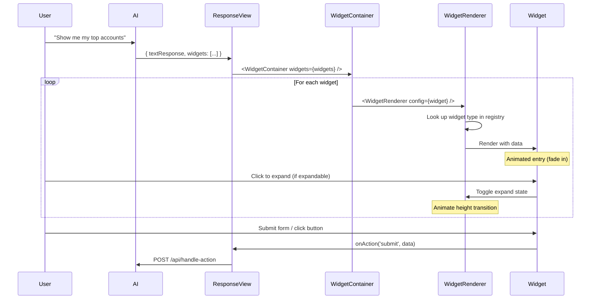

# Widget System Architecture

```mermaid
graph TB
    subgraph "AI Backend"
        AI[Azure OpenAI Service]
        API[Node.js API Gateway]
    end

    subgraph "Frontend Response Flow"
        Response[ResponseView.tsx]
        Container[WidgetContainer]
        Renderer[WidgetRenderer]
        Registry[WidgetRegistry]
    end

    subgraph "Widget Components"
        Chart[ChartWidget<br/>Progress bars, metrics]
        Form[FormWidget<br/>Call logging, forms]
        Table[TableWidget<br/>Account lists, data grids]
        Alert[AlertWidget<br/>Compliance warnings]
    end

    subgraph "UI Foundation"
        Shadcn[shadcn/ui Components]
        Motion[Framer Motion<br/>Animations]
        Tailwind[Tailwind CSS<br/>AZ Brand Colors]
    end

    AI -->|JSON with WidgetConfig[]| API
    API -->|Response| Response
    Response -->|widgets prop| Container
    Container -->|config| Renderer
    Renderer -->|lookup type| Registry
    Registry -->|component| Renderer
    Renderer -->|render| Chart
    Renderer -->|render| Form
    Renderer -->|render| Table
    Renderer -->|render| Alert

    Chart --> Shadcn
    Form --> Shadcn
    Table --> Shadcn
    Alert --> Shadcn

    Shadcn --> Tailwind
    Renderer --> Motion

    style Chart fill:#e1f5ff
    style Form fill:#fff4e1
    style Table fill:#f0e1ff
    style Alert fill:#ffe1e1
    style Registry fill:#e1ffe1
```

---

## Widget Flow Diagram



---

## Widget Type Hierarchy

```
WidgetConfig (Union Type)
│
├── ChartWidget
│   ├── chartType: 'bar' | 'line' | 'pie' | 'progress'
│   ├── data: ChartDataPoint[]
│   │   ├── label: string
│   │   ├── value: number
│   │   ├── percentage?: number
│   │   └── trend?: string
│   └── showTrend?: boolean
│
├── FormWidget
│   ├── fields: FormField[]
│   │   ├── name: string
│   │   ├── label: string
│   │   ├── type: 'text' | 'textarea' | 'select' | 'date' | 'number'
│   │   ├── required?: boolean
│   │   └── options?: { value, label }[]
│   └── submitLabel?: string
│
├── TableWidget
│   ├── columns: TableColumn[]
│   │   ├── key: string
│   │   ├── label: string
│   │   ├── type: 'text' | 'number' | 'currency' | 'badge'
│   │   └── sortable?: boolean
│   ├── rows: Record<string, any>[]
│   ├── sortable?: boolean
│   └── pageSize?: number
│
└── AlertWidget
    ├── severity: 'info' | 'warning' | 'error' | 'success'
    ├── title: string
    ├── message: string
    ├── actions?: Array<{ label, onClick, variant }>
    └── dismissible?: boolean
```

---

## Animation Timeline

```
WidgetContainer Mount
│
├─┬─ Widget 1
│ ├─ delay: 0ms
│ ├─ opacity: 0 → 1 (300ms)
│ └─ y: 20 → 0 (300ms, spring)
│
├─┬─ Widget 2
│ ├─ delay: 100ms
│ ├─ opacity: 0 → 1 (300ms)
│ └─ y: 20 → 0 (300ms, spring)
│
└─┬─ Widget 3
  ├─ delay: 200ms
  ├─ opacity: 0 → 1 (300ms)
  └─ y: 20 → 0 (300ms, spring)

User Clicks Expand
│
├─ height: 0 → auto (200ms, easeOut)
└─ opacity: 0 → 1 (200ms, easeOut)
```

---

## State Management Flow

```
Parent State (ResponseView)
│
├─ aiResponse: {
│    textResponse: string
│    widgets: WidgetConfig[]
│  }
│
└─ handleWidgetAction(action, data)
   │
   ├─ 'submit' → POST to API
   ├─ 'export' → Download CSV
   ├─ 'action-clicked' → Trigger action
   └─ 'toggle-expand' → Update local state

Widget Props
│
├─ config: WidgetConfig
│  ├─ id: string
│  ├─ type: string
│  ├─ title?: string
│  ├─ expanded?: boolean
│  └─ data: WidgetData
│
└─ onAction: (action, data) => void
```

---

## Widget Registry Pattern

```
WidgetRegistry (Singleton)
│
├─ private widgets: Map<string, WidgetRegistration>
│
├─ register(registration)
│  └─ widgets.set(type, { component, expandable, defaultExpanded })
│
├─ get(type)
│  └─ widgets.get(type)?.component
│
├─ has(type)
│  └─ widgets.has(type)
│
└─ getMetadata(type)
   └─ { expandable, defaultExpanded }
```

---

## Compliance Detection Flow

```
User Input (SmartInputDock)
│
├─ checkCompliance(text)
│  ├─ Meal spend keywords → Warning
│  ├─ Off-label keywords → Stop
│  └─ No violations → Allow
│
├─ Violation detected?
│  │
│  ├─ Yes → Show CoachingCard
│  │        ├─ Severity: warning/error
│  │        ├─ Actions: Revise/Cancel
│  │        └─ Block submission
│  │
│  └─ No → Submit to AI
│           └─ AI generates widget response
```

---

## Example Widget Transformation

```
Static ResponseView (Before)
│
├─ <TopProductsCard />
│  └─ Hard-coded product data
│
├─ <CRMAccountsList />
│  └─ Hard-coded CRM data
│
└─ Can't inject new UI from AI

↓ Migrate to Widget System ↓

Widget-Based ResponseView (After)
│
├─ AI decides what to show
│  └─ { widgets: WidgetConfig[] }
│
├─ <WidgetContainer widgets={widgets} />
│  ├─ WidgetRenderer → ChartWidget
│  ├─ WidgetRenderer → TableWidget
│  └─ WidgetRenderer → FormWidget
│
└─ Dynamic, AI-driven UI
```

---

## Performance Characteristics

```
Initial Page Load
│
├─ Widget bundle: ~45KB (gzipped)
├─ First paint: <2s (95th percentile)
└─ Time to interactive: <3s

Widget Render
│
├─ Chart widget: <50ms
├─ Form widget: <30ms
├─ Table widget (10 rows): <80ms
└─ Alert widget: <20ms

Animation Frame
│
├─ Entry animation: 300ms per widget
├─ Expand/collapse: 200ms
└─ 60fps (16.67ms per frame)
```

---

## Type Safety Chain

```
AI Response (JSON)
│
├─ Validate against WidgetConfig schema
│  ├─ Must have: id, type, data
│  └─ Type-specific validation
│     ├─ Chart: data.data[], data.chartType
│     ├─ Form: data.fields[], data.fields[].name
│     ├─ Table: data.columns[], data.rows[]
│     └─ Alert: data.severity, data.message
│
├─ WidgetRegistry.get(type)
│  └─ Returns: WidgetRenderer<ComponentType>
│
└─ Render with config
   └─ TypeScript ensures correct props
```

---

## Design System Integration

```
AZ Brand Colors (globals.css)
│
├─ --color-mulberry (primary)
│  └─ Chart bars, primary buttons
│
├─ --color-gold (accent)
│  └─ Focus indicators, warnings
│
├─ --color-graphite (text)
│  └─ Body text, labels
│
└─ --color-platinum (muted)
   └─ Secondary text, borders

shadcn/ui Components
│
├─ Button (primary, outline, ghost)
├─ Input (text, number, date)
├─ Textarea (multi-line)
└─ Card (widget containers)

Framer Motion
│
├─ motion.div (entry animations)
├─ AnimatePresence (expand/collapse)
└─ spring (natural physics)
```

---

## File Organization

```
rep-copilot/
│
├─ src/
│  ├─ app/
│  │  ├─ page.tsx (Main entry)
│  │  └─ globals.css (AZ brand colors)
│  │
│  ├─ components/
│  │  ├─ ResponseView.tsx (Legacy - to be migrated)
│  │  ├─ ResponseViewWithWidgets.tsx (New - widget-based)
│  │  ├─ SmartInputDock.tsx (Input + compliance check)
│  │  └─ ui/ (shadcn/ui components)
│  │
│  └─ widgets/
│     ├─ types.ts (Type definitions)
│     ├─ WidgetRegistry.ts (Singleton registry)
│     ├─ WidgetRenderer.tsx (Container component)
│     ├─ index.ts (Registration + exports)
│     ├─ README.md (This file)
│     │
│     └─ widgets/
│        ├─ ChartWidget.tsx
│        ├─ FormWidget.tsx
│        ├─ TableWidget.tsx
│        └─ AlertWidget.tsx
│
├─ WIDGET_SYSTEM_GUIDE.md (Usage guide)
└─ WIDGET_SYSTEM_ARCHITECTURE.md (This file)
```
